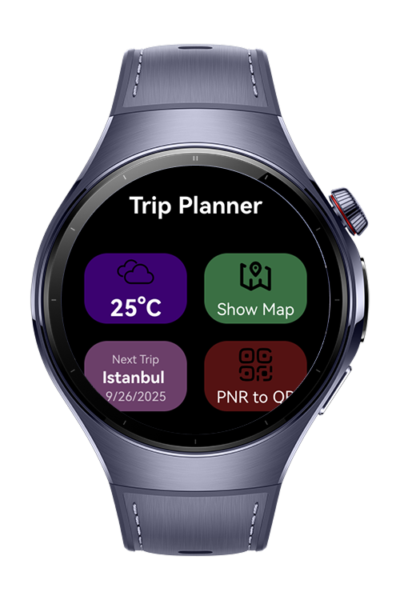
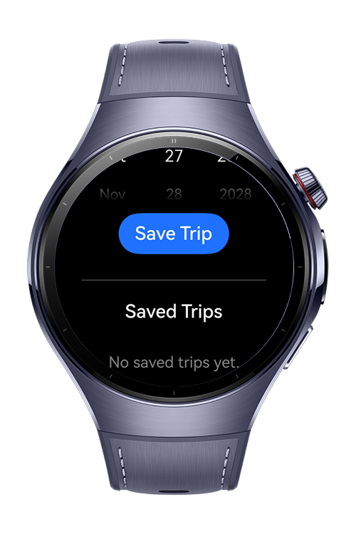

> **Note:** To access all shared projects, get information about environment setup, and view other guides, please visit [Explore-In-HMOS-Wearable Index](https://github.com/Explore-In-HMOS-Wearable/hmos-index).

# TrackWay

TrackWay is a wearable application built for HarmonyOS. It helps users about new visits and trips. TrackWay app can save trips and show the near transport stations. Also, the program can generate QR code include the users' ticket pnr. Firstly, user have to enter with username and password or Huawei Id. After that, program show 4 box with different feature. Weather conditions, PNR ticket to barcode page, map page and save trip page.
User can select whatever feature they want. Depending on the feature selected, the program performs the necessary operations. The program is quick and easy to use, making it user-friendly.

# Preview

<div>
  
  
  
  

</div>


# Use Cases

Login: Login with username and password or the Huawei Id

Weather Conditions: TrackWay show the weather condition

Show transportation station: Check the near public transportation stations on the map

Ticket to QR: Convert your ticket PNR code to QR code on the wearable

Save the visits: Add all your trips to your calendar and see them later.

# Tech Stack

- **Languages**: ArkTS, ArkUI, TypeScript
- **Frameworks**: HarmonyOS SDK 5.1.0(18)
- **Tools**: DevEco Studio Version 5.1.1.823
- **Libraries**:
  - `@kit.ArkUI`
  - `@kit.ArkTS`
  - `@kit.ArkData`
  - `@kit.BasicServicesKit`
  - `@kit.AbilityKit`
  - `@kit.PerformanceAnalysisKit`
  - `@kit.MapKit`
  - `@kit.LocationKit`
  - `@kit.ScanKit`
  - `@kit.AccountKit`
  - `@kit.CalendarKit`


# Directory Structure
```
├───common
│       types.ets
│
├───entryability
│       EntryAbility.ets
│
├───entrybackupability
│       EntryBackupAbility.ets
│
├───model
│       Location.ets
│       PublicTransportStation.ets
│       Ticket.ets
│       TravelPlan.ets
│       Trip.ets
│       User.ets
│       Weather.ets
│
├───pages
│       HomePage.ets
│       Index.ets
│       LoginPage.ets
│       MapPage.ets
│       PnrPage.ets
│       TripLoggerPage.ets
│
├───service
│       BarcodeService.ets
│
├───view
│       HomeView.ets
│       MapMiniView.ets
│       PNRView.ets
│       QRPreview.ets
│
└───viewmodel
        GenerateQRViewModel.ets
        LoginViewModel.ets
        PNRViewModel.ets
        TripViewModel.ets

```
# Constraints and Restrictions
## Requirements
1. Configure signing settings.
2. Change module.json with your wearable app bundle name.
3. Change watch app bundle name with your bundle name.
4. Add the permission module.json5 `ohos.permission.READ_CALENDAR`
5. Add the permission EntryAbility.ets `ohos.permission.READ_CALENDAR`
6. Add the finger print files from App Gallery Connect for activate Map Kit

## Supported Device

* Huawei Watch 5

# License

**TrackWay** is distributed under the terms of the MIT License
See the [LICENSE](./LICENSE) for more information.